# GAIA Agent Enhanced Architecture

This diagram illustrates the current architecture of our GAIA agent: a LangGraph state machine with a **Perception → Planner → State Manager** front end, **six specialized executors**, a **Reflector/Verifier** self-check loop, and a rich tool layer spanning web, academic, media, filesystem, and code-execution domains.

```mermaid
graph TD
    %% ===== Entry & Planning =====
    Start((Start)):::terminal --> Perception[Perception Node<br/>Modality + File Detection]:::perception
    Perception --> Planner[Planner Node<br/>Strategic Hub · Strong Model]:::control

    %% ===== Main Reasoning Loop =====
    subgraph Loop["🔁 Reasoning & Execution Loop"]
        Planner --> StateManager{{State Manager<br/>The Brain · Cheap Model}}:::brain

        %% Multi-Expert Routing (6 domains)
        StateManager -- "MATH" --> ExecMath[Executor: Math<br/>Cheap Model]:::execCheap
        StateManager -- "RESEARCH" --> ExecResearch[Executor: Research<br/>Strong Model]:::execStrong
        StateManager -- "VISION" --> ExecVision[Executor: Vision<br/>Strong Model]:::execStrong
        StateManager -- "AUDIO" --> ExecAudio[Executor: Audio<br/>Strong Model]:::execStrong
        StateManager -- "FILE" --> ExecFile[Executor: File<br/>Strong Model]:::execStrong
        StateManager -- "GENERAL" --> ExecGeneral[Executor: General<br/>Strong Model]:::execStrong

        ExecMath --> Reflector[Reflector Node<br/>Verifier Model]:::reflect
        ExecResearch --> Reflector
        ExecVision --> Reflector
        ExecAudio --> Reflector
        ExecFile --> Reflector
        ExecGeneral --> Reflector

        Reflector -- "Working Memory + Chronicle Update" --> StateManager
    end

    %% ===== Verification & Finalization =====
    StateManager -- "Draft Answer Ready" --> Verifier{Verifier Node}:::control
    Verifier -- "REJECTED (Critique)" --> Planner
    Verifier -- "APPROVED" --> Formatter[Formatter Node<br/>GAIA Exact-Match]:::control
    Formatter --> End((Final Answer)):::terminal

    %% ===== State Management (AgentState) =====
    subgraph State["🧠 State Management · AgentState"]
        Chronicle[(Task Chronicle<br/>Persistent Facts)]:::state
        TodoList{{Dynamic Todo List}}:::state
        WorkingMemory[Working Memory<br/>Raw Observations]:::state
        Plan[(Plan + step_idx)]:::state
        Sandbox[(Agent Sandbox<br/>Context Offloading)]:::state
    end

    Planner -.writes.-> Plan
    Planner -.seeds.-> TodoList
    StateManager -.updates.-> TodoList
    Reflector -.appends.-> Chronicle
    Reflector -.appends.-> WorkingMemory
    ExecResearch -.write_file.-> Sandbox
    ExecFile -.read/grep.-> Sandbox
    Sandbox -.ls/grep/read.-> StateManager

    %% ===== Tool Layer =====
    subgraph Tools["🛠️ Tool Layer (LangChain @tool registry)"]
        direction LR
        subgraph Web["🌐 Web & Search"]
            T_DDG[[web_search · DDGS]]:::toolWeb
            T_Tavily[[tavily_search]]:::toolWeb
            T_Fetch[[fetch_url · trafilatura]]:::toolWeb
        end
        subgraph Academic["📚 Academic"]
            T_Arxiv[[arxiv_search]]:::toolAcad
            T_Crossref[[crossref_search]]:::toolAcad
            T_Count[[count_journal_articles]]:::toolAcad
            T_Filter[[filter_entities]]:::toolAcad
        end
        subgraph Media["🎬 Media & Perception"]
            T_PDF[[inspect_pdf · pypdf]]:::toolMedia
            T_Vision[[inspect_visual_content · Gemini]]:::toolMedia
            T_Whisper[[transcribe_audio · faster-whisper]]:::toolMedia
            T_YT[[youtube_transcript]]:::toolMedia
        end
        subgraph FS["📁 Filesystem & Todos"]
            T_Read[[read_file]]:::toolFS
            T_Ls[[ls]]:::toolFS
            T_Grep[[grep]]:::toolFS
            T_Glob[[glob_files]]:::toolFS
            T_Write[[write_file]]:::toolFS
            T_Todos[[write_todos / mark_todo_done]]:::toolFS
        end
        subgraph Code["🐍 Code Sandbox"]
            T_Py[[run_python · subprocess]]:::toolCode
        end
    end

    ExecResearch -.-> Web
    ExecResearch -.-> Academic
    ExecResearch -.-> Media
    ExecVision -.-> Media
    ExecAudio -.-> Media
    ExecFile -.-> FS
    ExecFile -.-> Media
    ExecMath -.-> Code
    ExecGeneral -.-> Web
    ExecGeneral -.-> FS

    %% ===== Styling =====
    classDef terminal    fill:#1f2937,stroke:#0f172a,stroke-width:2px,color:#f9fafb
    classDef perception  fill:#e0f2fe,stroke:#0284c7,stroke-width:2px,color:#0c4a6e
    classDef control     fill:#fef3c7,stroke:#d97706,stroke-width:2px,color:#78350f
    classDef brain       fill:#fde68a,stroke:#b45309,stroke-width:3px,color:#78350f
    classDef execCheap   fill:#dcfce7,stroke:#16a34a,stroke-width:2px,color:#14532d
    classDef execStrong  fill:#dbeafe,stroke:#2563eb,stroke-width:2px,color:#1e3a8a
    classDef reflect     fill:#ede9fe,stroke:#7c3aed,stroke-width:2px,color:#4c1d95
    classDef state       fill:#fef9c3,stroke:#ca8a04,stroke-width:1px,color:#713f12
    classDef toolWeb     fill:#cffafe,stroke:#0891b2,stroke-width:1px,color:#164e63
    classDef toolAcad    fill:#fce7f3,stroke:#db2777,stroke-width:1px,color:#831843
    classDef toolMedia   fill:#ede9fe,stroke:#8b5cf6,stroke-width:1px,color:#4c1d95
    classDef toolFS      fill:#ecfccb,stroke:#65a30d,stroke-width:1px,color:#365314
    classDef toolCode    fill:#ffedd5,stroke:#ea580c,stroke-width:1px,color:#7c2d12
```

**Legend**: 🔷 Perception (entry) · 🟡 Control nodes (Planner/State Manager/Verifier/Formatter) · 🟢 Cheap-tier executor (Math) · 🔵 Strong-tier executors (Research/Vision/Audio/File/General) · 🟣 Reflector · 🟨 AgentState stores · Tool groups: 🟦 Web · 🟪 Academic · 🟣 Media · 🟢 Filesystem · 🟧 Code.

## Key Components

1.  **Perception Node**: Entry point. Detects the task `modality` (text/web/pdf/excel/audio/image/etc.) and resolves `file_path` before planning begins.
2.  **Planner (Strategic Hub)**: Uses the **Strong model** to draft a `plan: list[PlanStep]` and seed the `todo_list`. Re-invoked when the Verifier rejects a draft.
3.  **State Manager (The Brain)**: Replaced the static Orchestrator. Runs on a **Cheap model** (e.g. Gemini Flash) and — based on the `todo_list`, `task_chronicle`, and latest observations — routes to one of six specialized executors or to the Verifier when a draft answer is ready.
4.  **Six Specialized Executors**: `exec_math`, `exec_research`, `exec_vision`, `exec_audio`, `exec_file`, `exec_general`. Math uses the Cheap tier for structured extraction; the rest use the Strong tier for complex reasoning and multimodal work. All executors share the same tool registry but are prompted for their domain.
5.  **Reflector**: After every executor turn, integrates tool results into `working_memory` and emits `CHRONICLE UPDATE` lines that get appended to the persistent `task_chronicle`.
6.  **Verifier → Formatter**: Verifier critiques the draft; on `APPROVED` the Formatter normalizes the output to GAIA exact-match rules, on `REJECTED` control returns to the Planner with the critique.
7.  **Model Intelligence Tiering**: Cheap tier for orchestration + Math; Strong tier for reasoning, research, and multimodal; a separate Verifier model for reflection and final checks.
8.  **AgentState**: Central `TypedDict` carrying `plan`, `step_idx`, `observations`, `working_memory`, `task_chronicle`, `todo_list`, `current_domain`, `draft_answer`, `critique`, `retries`, `final_answer`.
9.  **Context Offloading (Agent Sandbox)**: Instead of keeping bulky tool output in `working_memory`, executors dump it to the sandbox with `write_file` and later retrieve slices via `ls` / `grep` / `read_file` — this keeps the context window lean across long runs.
10. **Tool Layer** (LangChain `@tool` registry in [`src/gaia_agent/tools/__init__.py`](../src/gaia_agent/tools/__init__.py)):
    - **Web & Search**: `web_search` (DDGS, zero-cost), `tavily_search` (backup), `fetch_url` (trafilatura main-text extraction).
    - **Academic**: `arxiv_search`, `crossref_search`, `count_journal_articles`, `filter_entities` (prunes broad bibliographic lists).
    - **Media & Perception**: `inspect_pdf` (pypdf), `inspect_visual_content` (Gemini multimodal), `transcribe_audio` (faster-whisper), `youtube_transcript`.
    - **Filesystem & Todos**: `read_file`, `ls`, `grep`, `glob_files`, `write_file`, `write_todos`, `mark_todo_done`.
    - **Code Sandbox**: `run_python` — subprocess-isolated Python with `requests`, `bs4`, `pandas`, `trafilatura`, `openpyxl`, `faster-whisper`, `pypdf` preinstalled.
