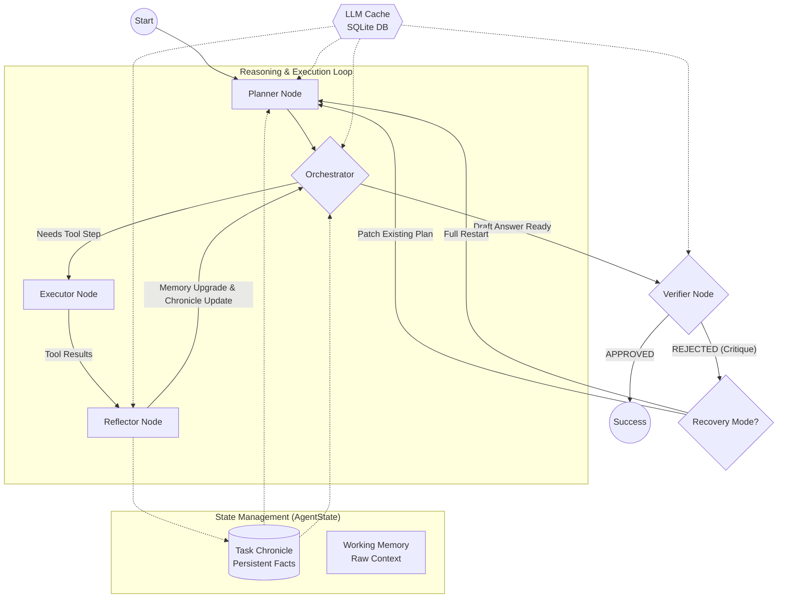

# GAIA Agent Enhanced Architecture

This diagram illustrates the current refined architecture of our GAIA agent, incorporating the **Planner Recovery Mode** and the **Task Chronicle** system.

### Key Components:

1.  **Task Chronicle**: A central, persistent memory that stores only definitive facts (e.g., "USDA 1959 document found"). It survives even when a plan is rejected.
2.  **Planner Recovery Mode**: When the Verifier gives a critique (e.g., "wrong format"), the Planner uses the Chronicle and the critique to generate a "patch" step instead of restarting the whole research process.
3.  **Orchestrator**: Acts as the executive brain, checking the Chronicle first to see if a final answer can be synthesized early.
4.  **Reflector**: Crucial for state maintenance; it extracts `CHRONICLE UPDATE` lines from tool results to keep the mission on track.
5.  **LLM Cache**: Speeds up the entire loop by skipping identical LLM triggers for repeated runs or debugging.
