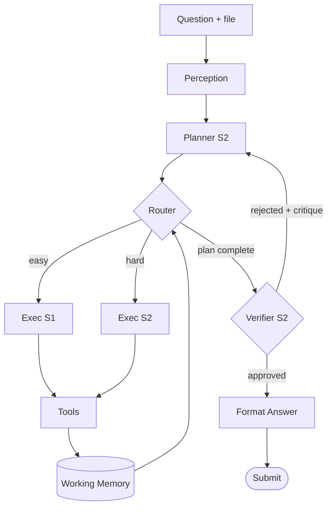

# GAIA Agent Architecture — Plan → Execute → Verify with System 1 / System 2

## Graph

## Nodes

| Node | Role | Model Tier | Neuro Analog |
|---|---|---|---|
| Perception | Detect modality, fetch `/files/{task_id}`, classify question type | none (rule-based) | Sensory cortex |
| Planner | One strong call: writes 3–5 step plan + expected answer shape | System 2 | Prefrontal cortex |
| Router | Per-step dispatch: routes each plan step to S1 or S2 | none (rule-based) | Basal ganglia (action gating) |
| Executor S1 | Routine tool calls: search, fetch, file read | System 1 (cheap) | Motor cortex (habitual) |
| Executor S2 | Reasoning-heavy steps: multi-hop, ambiguous | System 2 (strong) | Motor cortex (deliberate) |
| Tools | tavily, fetch+trafilatura, python, pdf/xlsx/csv/docx, whisper, yt-transcript | — | Effectors |
| Working Memory | Typed state dict: plan, step_idx, observations, draft, critique | — | Hippocampus / DLPFC scratchpad |
| Verifier | Final check: answer fits question? format exact-match ready? | System 2 | Anterior cingulate (error detection) |
| Format | Strip prose into exact-match shape for GAIA grader | none (rule-based) | — |

## Key design decisions

1. **One Planner call per question**, not per step — protects S2 quota.
2. **Router is rule-based**, not LLM — free, deterministic, fast. Upgrade path: swap to a tiny LLM classifier if rules misroute.
3. **Verifier rejection → back to Planner**, not back to Executor. If the answer is wrong, the plan was likely wrong.
4. **Format is a separate node** from Verifier. GAIA is exact-match graded; ~5% score lift comes from stripping prose and normalizing units.
5. **Working Memory is typed state** (TypedDict + JSON checkpoint) — enables resumable runs after a quota hit.
6. **Model tiering is config**, not code — swap `cheap_model` and `strong_model` via env vars for dev/staging/prod runs.
