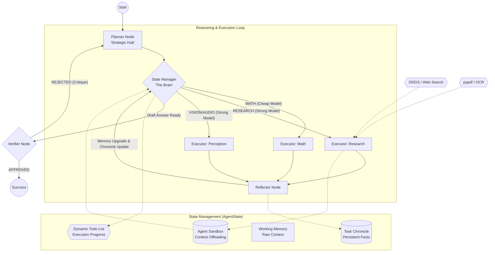

# GAIA Agent Enhanced Architecture

This diagram illustrates the current refined architecture of our GAIA agent, incorporating the **State Manager**, **Dynamic Todo List**, and the **Context Offloading** system.

### Key Components:

1.  **State Manager (The Brain)**: Replaced the static Orchestrator. It monitors the **Todo List** and **Chronicle** using a **CHEAP model** (e.g., Gemini Flash) to decide the next strategic move.
2.  **Model Intelligence Tiering**: 
    - **Cheap Tier**: Used for orchestration (State Manager) and formatted data extraction (Math).
    - **Strong Tier**: Used for complex reasoning, long-document research, and multimodal analysis.
3.  **Dynamic Todo List**: A self-managed list where the agent writes its own sub-tasks. It allows the agent to track multi-stage progress more reliably than a fixed plan.
4.  **Context Offloading (Filesystem Toolkit)**: To prevent context window overflow, the agent uses atomic tools (`ls`, `grep`, `write_file`) to store intermediate data in the sandbox instead of keeping it all in Working Memory.
5.  **Task Chronicle**: A central, persistent memory that stores only definitive facts. It survives even if a specific plan step fails.
6.  **Reflector**: Crucial for state maintenance; it integrates tool results into Working Memory and identifies `CHRONICLE UPDATE` lines to keep the mission on track.
7.  **Modernized Search (DDGS)**: Uses the `ddgs` (DuckDuckGo) library for zero-cost, high-resiliency web research.
